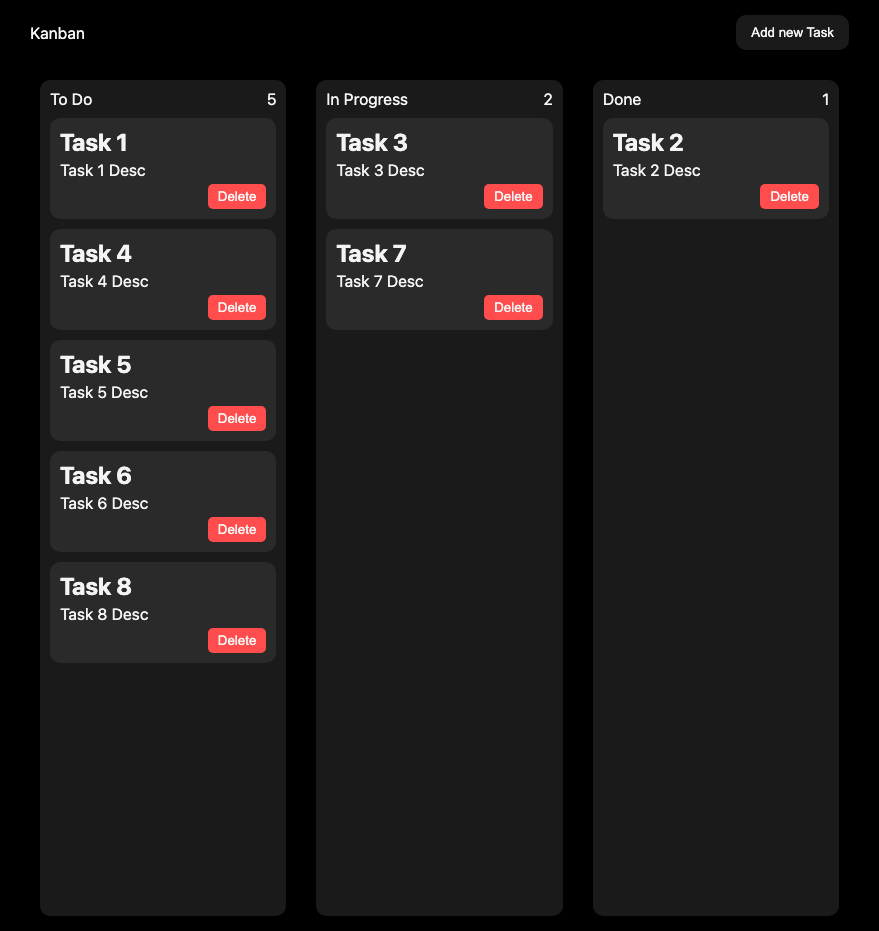
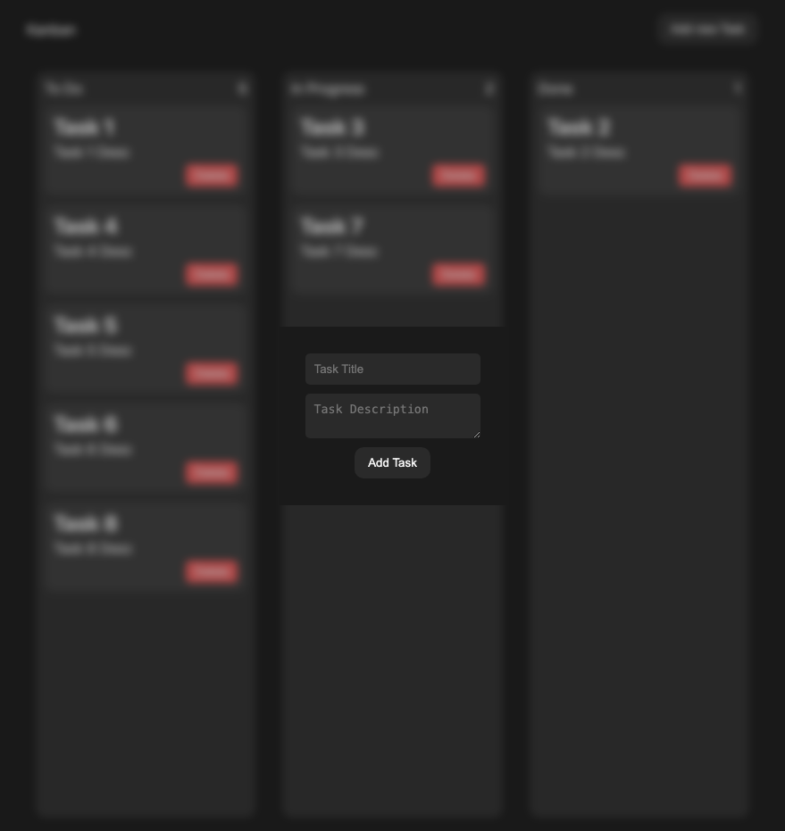

# 📌 Kanban Board

A responsive Kanban Board built using **HTML, CSS, and JavaScript** that helps users manage tasks visually using drag-and-drop interactions.

Users can create tasks, move them across workflow stages, delete tasks, and keep progress persisted using **Local Storage**.

---

## 🚀 Live Demo

Add your deployed URL here:

```txt
https://akhil9982.github.io/kanban-board/
```

---

## 📷 Screenshots

### Board View



### Add Task Modal



---

## ✨ Features

- Create new tasks
- Drag & drop task cards between columns
- Delete tasks
- Modal-based task creation
- Dynamic task count per column
- Persistent data using Local Storage
- Responsive UI
- Automatic state restoration after refresh

---

## 🧠 Concepts Practiced

This project helped practice:

- DOM Manipulation
- Event Handling
- Drag and Drop API
- Local Storage
- Dynamic Element Creation
- Template Literals
- Array Methods
- State Synchronization
- Component-like UI thinking using Vanilla JS

---

## 🛠 Tech Stack

**Frontend**
- HTML5
- CSS3
- JavaScript (ES6)

**Browser APIs**
- Drag & Drop API
- Local Storage

---

## 📂 Project Structure

```txt
KANBAN-BOARD/
│
├── Images/
│   ├── Kanban-Board.png
│   └── Kanban-add-task.png
│
├── index.html
├── style.css
├── script.js
└── README.md
```

---

## ⚙️ Installation

Clone the repository:

```bash
git clone https://github.com/Akhil9982/kanban-board.git
```

Move into the project:

```bash
cd kanban-board
```

Open:

```txt
index.html
```

or run using VS Code Live Server.

---

## 🎯 Future Improvements

- Edit existing tasks
- Dark mode
- Column creation
- Search & filter
- Due dates
- Mobile drag improvements
- Backend persistence
- User authentication

---

## 📚 What I Learned

While building this project, I improved understanding of:

- Managing UI state
- Working with browser storage
- Handling drag events correctly
- Updating DOM efficiently
- Structuring JavaScript into reusable functions

---

## 👨‍💻 Author

Akhil

GitHub:
https://github.com/Akhil9982

---

## ⭐ Support

If you found this useful, consider giving the repository a star.